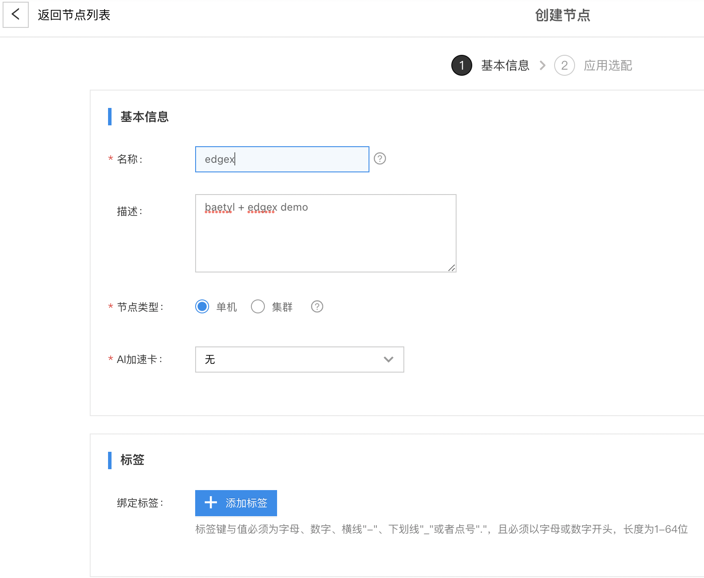
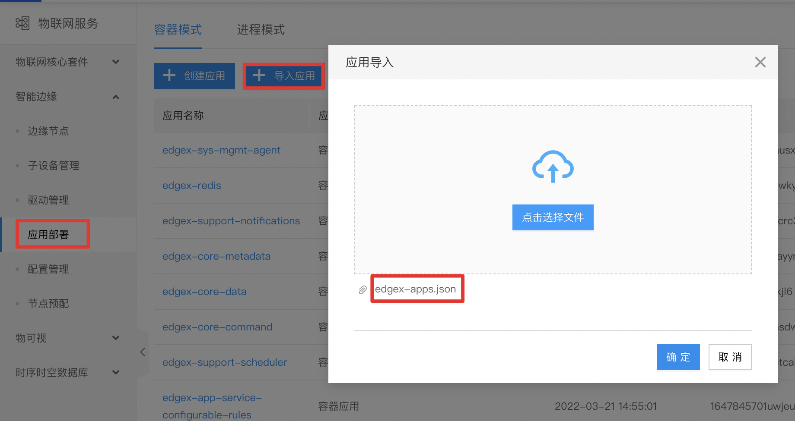
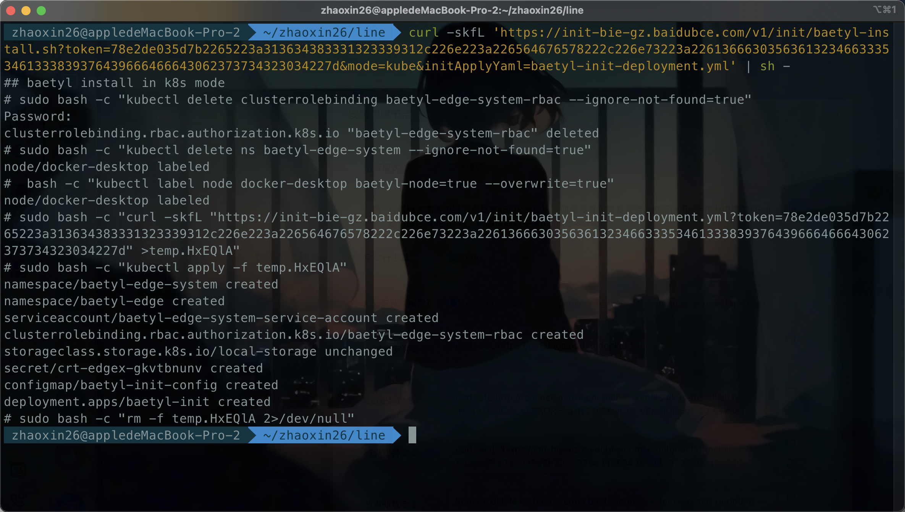
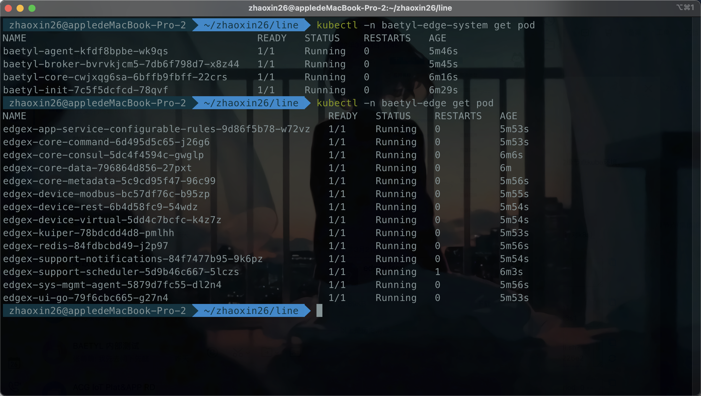
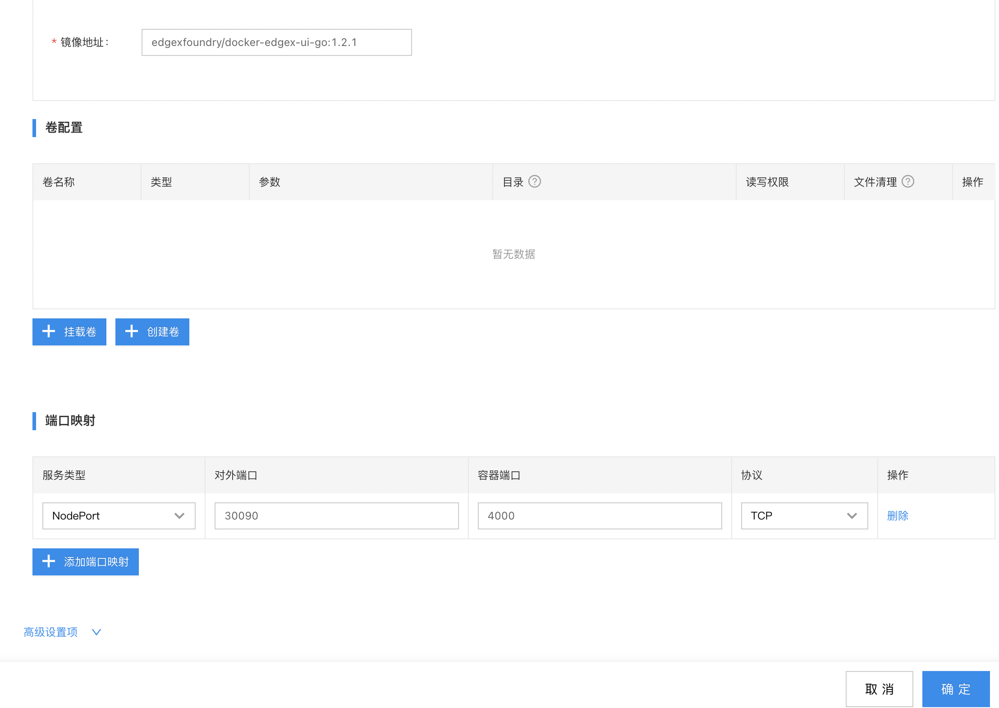
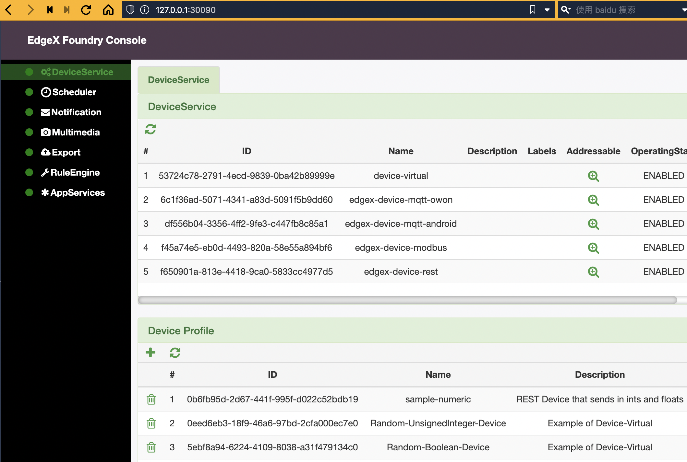
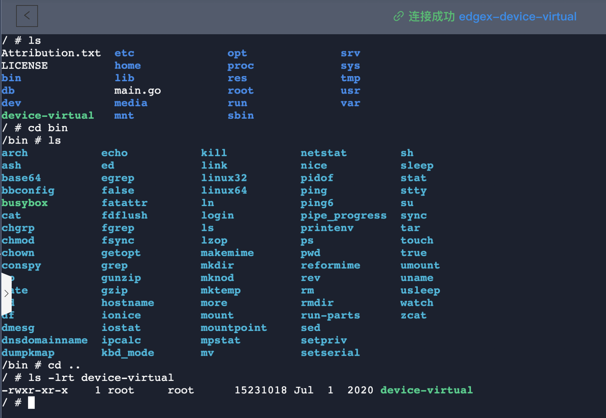

# edgex-demo
## 1、demo介绍
### 1.1 实现功能
* 通过 baetyl 远程向边缘侧下发 edgex 全套组件
* 在边缘侧访问部署的 edgex 服务
* 在云端控制台远程调试 edgex 服务相关应用

### 1.2 部署应用介绍
部署**14**个edgex应用

* edgex-sys-mgmt-agent  
是 edgex 系统中提供其他微服务生命周期管理的一个微服务，它主要提供3个功能：start,stop,restart其他微服务，获取微服务的配置参数，获取微服务运行时的metric指标  

* edgex-redis  
redis 内存数据结构存储系统，可以用作数据库、缓存和消息中间件

* edgex-support-notifications  
是 edgex 系统中的提醒服务

* edgex-core-metadata
是 edgex 系统中设备微服务和设备以及设备数据相关的元数据管理服务

* edgex-core-data  
是 edgex 系统中数据持久化的服务

* edgex-core-command  
是向设备发送命令的微服务，他自己提供接口接收来自其他微服务的命令并将该命令发送到相应的设备微服务从而间接的将该命令下发到过载在该设备微服务的具体物理设备上

* edgex-support-scheduler  
支持设置定时任务，定时从设备中采集数据

* edgex-app-service-configurable-rules  
规则引擎服务

* edgex-kuiper  
EMQ 发布的基于 SQL 的轻量级边缘流式数据分析引擎

* edgex-device-virtual  
虚拟设备服务，会不断从该微服务内置的数据库中随机读取数据（包括设备和数值）发送到 edgex

* edgex-device-rest  
rest 设备

* edgex-ui-go  
提供边缘设备管理的ui操作界面，提供对设备、规则、日志等的可视化操作与查看

* edgex-device-modbus  
用于将 Modbus 设备连接到 edgex 的设备服务

* edgex-core-consul  
使用 Consul 来注册其服务。每一个微服务启动后，都会通过 restful api 的形式将自己的配置注册到到 consul 的微服务（注册服务器）中。当一个服务器要和另外一个服务器通讯时，首先要先将目标服务器中的配置从注册服务器中拿出来，然后在通过 API 的形式去访问

## 2、操作实践
### 2.1 登录
登录百度云边缘计算控制台[BIE](https://console.bce.baidu.com/iot2/bie/node/list)

### 2.2 创建节点
1. 点击左侧【边缘节点】Tab
2. 点击【创建节点】按钮，按如下内容创建节点
  * 名称: **edgex**
  * 类型：根据情况选择
  * AI加速卡：无
  * 选择官方系统模块：不需要勾选  

### 2.3 导入应用
1. 点击左侧【应用部署】Tab
2. 点击【导入应用】按钮，选择**edgex-app.json**文件导入，此操作将导入**14**个edgex应用并匹配到之前创建的**edgex**节点
3. 点击可以查看各个应用详情  

### 2.4 安装节点
1. 点击左侧【边缘节点】Tab
2. 点击之前创建的**edgex**节点
3. 点击【安装】按钮，如果系统为linux且没有docker及k3s，则分别复制docker及k3s安装命令在控制台执行安装，如果系统为macos，则k8s安装流程如下：[mac安装k8s](https://github.com/AliyunContainerService/k8s-for-docker-desktop)
4. 在环境安装完成后，复制节点安装命令并在控制台执行  

5. 通过 kubectl -n baetyl-edge-system get pod 可以查看 baetyl 系统模块的运行情况
6. 通过 kubectl -n baetyl-edge get pod 可以查看用户模块的运行情况（edgex即在此命名空间下），等待镜像下载启动后，状态如下  

### 2.5 服务访问
1. 这里访问 edgex 的 ui 可视化服务，ui服务已配置暴露容器内4000端口到宿主机**30090**，可以在控制台【应用部署】Tab下面，**edgex-ui-go**应用，点击标准应用，在【端口映射】处可以修改  

2. 本机访问 127.0.0.1:30090即可查看 ui 页面  

3. 同理本机访问 127.0.0.1:30085 即可查看consul服务注册的ui界面

### 2.6 远程调试
1. 点击【边缘节点】Tab，选择**edgex**节点进入节点详情页，点击查看【应用部署】下的【服务状态】
2. 选择待调试服务，点击右侧[+]按钮，选择【远程调试】  
